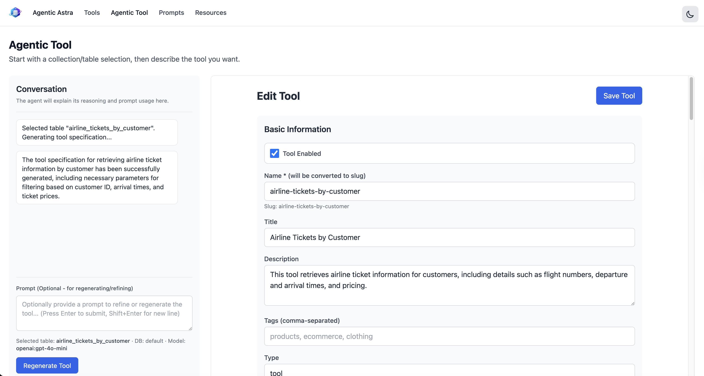

# Agentic Astra UI

A web-based interface for managing and generating MCP (Model Context Protocol) tools for your DataStax Astra DB tables and collections. Create, edit, and organize tools that enable AI agents to interact with your database.



## What is This?

Agentic Astra UI helps you:

- **Generate Tools**: Use AI to automatically generate and improve tool specifications for your Astra DB tables and collections
- **Manage Tools**: View, edit, and organize MCP tools in your catalog
- **Organize Resources**: Keep track of your database resources and prompts

## Quick Start

### Option 1: Run with npx (Recommended)

The easiest way to get started:

```bash
npx agentic-astra-ui
```

This will automatically install dependencies and start the server at `http://localhost:5150`.

### Option 2: Install Locally

1. **Clone or download this repository**

2. **Install dependencies:**
   ```bash
   npm install
   ```

3. **Set up environment variables:**
   
   Create a `.env.local` file in the project root with your Astra DB credentials:
   
   ```env
   ASTRA_DB_APPLICATION_TOKEN=your_astra_db_token
   ASTRA_DB_API_ENDPOINT=https://your-database-id-your-region.apps.astra.datastax.com
   ASTRA_DB_DB_NAME=your_database_name
   ASTRA_DB_CATALOG_COLLECTION=tool_catalog
   ```

4. **Start the development server:**
   ```bash
   npm run dev
   ```

5. **Open your browser:**
   
   Navigate to `http://localhost:5150`

## Getting Your Astra DB Credentials

If you don't have Astra DB credentials yet:

1. **Sign up for DataStax Astra DB** (if you haven't already):
   - Visit [astra.datastax.com](https://astra.datastax.com)
   - Create a free account

2. **Create a database:**
   - In the Astra DB dashboard, create a new database
   - Note the database name and region

3. **Get your application token:**
   - Go to your database settings
   - Navigate to "Token Management"
   - Create a new token with "Database Administrator" role
   - Copy the token (you'll only see it once!)

4. **Get your API endpoint:**
   - In your database dashboard, find the "API Endpoint" URL
   - It should look like: `https://your-database-id-your-region.apps.astra.datastax.com`

5. **Add these to your `.env.local` file** (see Quick Start above)

## Using the Application

### Tools Page

The main page shows all your tools in a searchable, sortable list:
- **View tools**: Browse all tools in your catalog
- **Edit tools**: Click on any tool to edit its details
- **Create new tool**: Click the "+ New Tool" button

### Agentic Tool Generator

Create new tools using AI assistance:

1. Navigate to **"Agentic Tool"** in the top menu
2. Choose your data type (Collection or Table)
3. Select the database and object you want to create a tool for
4. Provide a natural language description of what the tool should do
5. The AI will generate a complete tool specification
6. Review and edit the generated tool before saving

### Features

- **Dark Mode**: Toggle between light and dark themes using the theme switcher in the header
- **Search & Filter**: Quickly find tools in your catalog
- **Real-time Updates**: Changes are saved automatically to your Astra DB catalog collection

## Environment Variables

| Variable | Required | Description | Example |
|----------|----------|-------------|---------|
| `ASTRA_DB_APPLICATION_TOKEN` | Yes | Your Astra DB application token | `AstraCS:xxxxx...` |
| `ASTRA_DB_API_ENDPOINT` | Yes | Your database API endpoint URL | `https://abc123-us-east1.apps.astra.datastax.com` |
| `ASTRA_DB_DB_NAME` | Yes | Name of your Astra DB database | `my_database` |
| `ASTRA_DB_CATALOG_COLLECTION` | No | Collection name for storing tools | `tool_catalog` (default) |

## Troubleshooting

### "Failed to load tools" Error

- **Check your credentials**: Verify that your `.env.local` file has the correct values
- **Check your token**: Make sure your application token has the correct permissions
- **Check your endpoint**: Ensure the API endpoint URL is correct and includes `https://`
- **Check your database name**: Verify the database name matches exactly (case-sensitive)

### Server won't start

- **Check Node.js version**: Make sure you have Node.js 18 or higher installed
  ```bash
  node --version
  ```
- **Reinstall dependencies**: Try deleting `node_modules` and running `npm install` again
- **Check port availability**: The default port is 5150. If it's in use, set `PORT=5151` (or another port) in your environment

### Tools not appearing

- **Check collection name**: Verify that `ASTRA_DB_CATALOG_COLLECTION` matches the collection where your tools are stored
- **Check database connection**: Make sure your database is active and accessible
- **Check browser console**: Open browser developer tools (F12) to see any error messages

## Building for Production

To build the application for production:

```bash
npm run build
npm start
```

The production server will start on port 3000 by default (or the port specified in the `PORT` environment variable).

## Requirements

- **Node.js**: Version 18 or higher
- **npm**: Version 8 or higher (comes with Node.js)
- **Astra DB Account**: Active DataStax Astra DB account with a database

## Support

For issues, questions, or contributions:
- Check the [GitHub repository](https://github.com/smatiolids/agentic-astra-ui)
- Review the [DataStax Astra DB documentation](https://docs.datastax.com/en/astra/)

## License

MIT License - see LICENSE file for details
